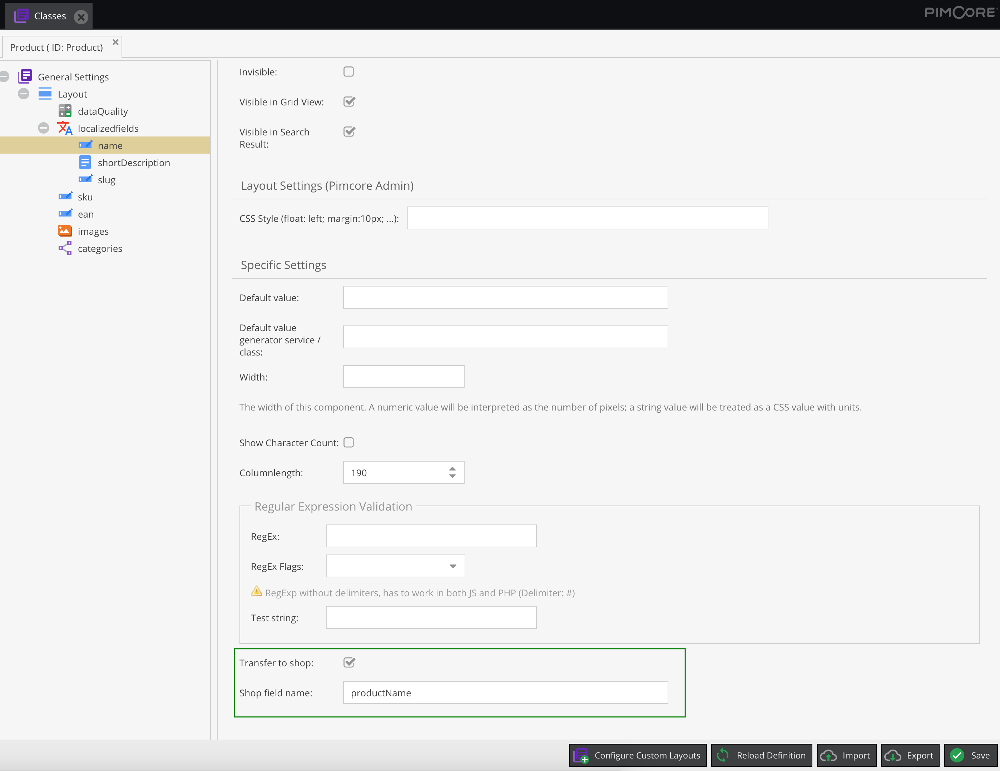

# Pimcore Custom Field Settings

This plugin can be used to add custom configurations to the field definitions of your data objects, object bricks, field collections and classification stores.

## Installation

### Composer

To get the plugin code you have to [buy the plugin](https://shop.blackbit.com/pimcore-custom-field-settings/) or write an email to [info@blackbit.de](mailto:info@blackbit.de).

You then either get access to the bundle's [Bitbucket repository](https://bitbucket.org/blackbitwerbung/pimcore-plugins-custom-field-settings) or you get the plugin code as a zip file. Accessing the Bitbucket repository has the advantage that you will always see changes to the plugin in the pull requests
and are able to update to a new version yourself - please visit [this page](https://shop.blackbit.de/de/service-xt-commerce/bitbucket-zugriff-xt-commerce-plugin-entwicklung) if this sounds interesting to you - if it does, please send us the email address of your BitBucket account so we can allow access to the repository.

When we allow your account to access our repository, please add the repository to the `composer.json` in your Pimcore root folder (see [Composer repositories](https://getcomposer.org/doc/05-repositories.md#vcs)):

```json
"repositories": [
    {
        "type": "vcs",
        "url": "git@bitbucket.org:blackbitwerbung/pimcore-plugins-custom-field-settings"
    }
]
```

(Please [add your public SSH key to your Bitbucket account](https://support.atlassian.com/bitbucket-cloud/docs/add-access-keys/#Step-3.-Add-the-public-key-to-your-repository) for this to work)

Alternatively if you received the plugin code as zip file, please upload the zip file to your server - e.g. create a folder `bundles` in the Pimcore root folder) and add the following to your `composer.json`:

```json
"repositories": [
    {
        "type": "artifact",
        "url": "./bundles/"
    }
]
```

Beware that when you put the zip directly in the Pimcore root folder, and add `"url": "./"` it will still work but Composer will scan *all* files under the Pimcore root recursively to find bundle zip files (incl. assets, versions etc) - which will take quite a long time.

Then you should be able to execute `composer require blackbit/custom-field-settings` (or `composer update blackbit/custom-field-settings --with-dependencies` for updates if you already have this bundle installed) from CLI.

At last you have to enable and install the plugin, either via browser UI or via CLI `bin/console pimcore:bundle:enable BlackbitCustomFieldSettingsBundle && bin/console pimcore:bundle:install BlackbitCustomFieldSettingsBundle`

You can always access the latest version by executing `composer update blackbit/custom-field-settings --with-dependencies` on CLI.

## Configuration

You can add custom field settings by configuring them in your `/config/config.yaml` (for Pimcore >= 10) or `/app/config/config.yml` (for Pimcore <= 6), e.g.
```yaml
blackbit_custom_field_settings:
  fields:
    transferToShop:
      field:
        xtype: checkbox
        fieldLabel: 'Transfer to shop'

    shopFieldName:
      useIn:
        fieldType: '^(input|numeric)$' # matches for input or numeric fields
        fieldName: '^erp_' # begins with erp_
      field:
        xtype: textfield
        fieldLabel: 'Shop field name'
      unique: true

    leadingSystem:
      field:
        xtype: combo
        fieldLabel: 'Leading system'
        store: # key-value list of possible options
          erp: ERP system
          pimcore: Pimcore

    priority:
      useIn:
        class: 'brick.TechnicalData'
      field:
        xtype: number
        fieldLabel: 'Priority'
      unique: true
```

On the level below `blackbit_custom_field_settings.fields` you have to specify your custom fields' names. Below that under `useIn` you can define criteria which have to match for this field to get added to your data object fields:

- `fieldType`: This is the internal fieldType name. As this is not visible anywhere in Pimcore UI, you can find the types in the [Pimcore configuration](https://github.com/pimcore/pimcore/blob/be90820c181894d3224a405c307c02ef6934c528/bundles/CoreBundle/Resources/config/pimcore/default.yaml#L134-L189). You can define the exact type or use a regular expression.
- `fieldName`: Add the custom field only to data object fields which match the given name. Can also be a regular expression.
- `class`: Only add the custom field if the given class name matches. Can also be regular expression. For object brick fields, please prepend `brick.`, e.g. `brick.TechnicalData` when you want to add the custom field to a brick named `TechnicalData`. For field collections prepend `fieldcollection.`.

If you do not provide `useIn`, the custom field will be available on all data object fields.

With the `field` config you can configure the custom field itself. It is mandatory to define the `xtype` which defines the type of the field (e.g. [textfield](https://docs.sencha.com/extjs/6.2.0/classic/Ext.form.field.Text.html#configs), [textarea](https://docs.sencha.com/extjs/6.2.0/classic/Ext.form.field.TextArea.html#configs), [checkbox](https://docs.sencha.com/extjs/6.2.0/classic/Ext.form.field.Checkbox.html#configs), [combo (select field)](https://docs.sencha.com/extjs/6.2.0/classic/Ext.form.field.ComboBox.html#configs), [number](https://docs.sencha.com/extjs/6.2.0/classic/Ext.form.field.Number.html#configs), [date](https://docs.sencha.com/extjs/6.2.0/classic/Ext.form.field.Date.html#configs) etc.). All options from ExtJS (the underlying JS framework which Pimcore uses for admin UI) are supported - as shown for `fieldLabel` above.

The `unqiue` flag defines if the custom field's values should be unique over all fields of the class / brick / field collection etc.



## Access custom field settings

The custom field settings are accessible in the field definition, e.g.
```php
$object = new \Pimcore\Model\DataObject\Product;

var_dump($object->getClass()->getFieldDefinition('name')->getCustomFields()); // outputs all custom field values as key-value array
var_dump($object->getClass()->getFieldDefinition('name')->getCustomField('transferToShop')); // outputs true in above example

// access field definition directly via class definition and not via data object's getClass()
ClassDefinition::getById('Product')->getFieldDefinition('name')->getCustomFields()
```